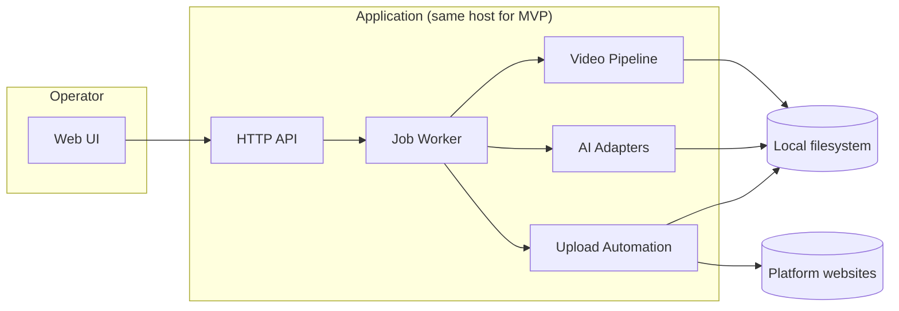

# Architecture v1 (MVP)

This document is the technical architecture draft for the MVP described in [`PRD.md`](./PRD.md). It defines boundaries, core data structures, API contracts at a draft level, and the job pipeline. Implementation details (exact libraries, selector maps for browser automation) are intentionally deferred to `[DEV]` spikes.

---

## 1. Goals and Constraints

| Goal | Implication |
|------|----------------|
| Local-first video ingest | Backend must run where disks are mounted; paths are authoritative. |
| Heavy CPU/GPU work (ASR, ffmpeg) | Prefer an async **job** model; web requests enqueue work and poll/stream status. |
| Per-platform export + metadata | Treat **platform** as a dimension on artifacts and metadata records. |
| Browser-based upload (PRD) | Isolate **uploader** behind an interface; session state is sensitive and must not leak to logs. |
| No automatic retries (MVP) | Fail-fast jobs; rich step logs for post-mortem. |
| Manual publish confirmation | Separate states: `upload_prepared` vs `published`; user action transitions. |

---

## 2. High-Level System Context



**MVP deployment assumption**: single machine (Windows acceptable for dev; Linux headless target per OPS rule). Web UI and worker may share one process initially (monolith) but **logical** boundaries below must remain separable for later split.

---

## 3. Logical Components

### 3.1 Web UI

- Configure **input root**, **output root**, and enabled platforms.
- List discovered **video assets**; search/filter by **tags**.
- Edit/confirm **tags** and AI-suggested tags.
- Trigger **pipeline job** for one selected video.
- Review per-platform **metadata** and **cover** preview.
- Drive **upload preparation** and final **Publish** confirmation per platform item.

### 3.2 HTTP API (control plane)

Responsibilities: validation, persistence of configuration and job records, artifact metadata indexing, log tail endpoints. It must not block on long-running ffmpeg/ASR.

### 3.3 Job Worker (execution plane)

Runs pipeline steps sequentially (MVP). Emits structured **step logs** and updates job state. On failure: stop immediately, persist error on the failing step.

### 3.4 Video Pipeline (`video_pipeline` domain)

- **Discovery**: recursive walk under input root; filter by extension/MIME sniff (implementation detail).
- **VAD + transcript alignment**: produces time-aligned segments for rhythm cuts.
- **Rhythm / speech-based cut**: selects segments to hit **30–60s** target duration (configurable bounds).
- **Burn-in subtitles**: render text onto video using a **default style template** (PRD).
- **Cover**: extract frame from **edited** timeline; overlay **cover caption** text.
- **Platform export**: ffmpeg graph per **platform profile** (resolution, SAR/DAR, fps, audio codec/bitrate).

### 3.5 AI Adapters (pluggable)

- **ASR**: Whisper-family or equivalent → `transcript` artifact with word/segment timestamps.
- **LLM**: structured JSON for tags suggestion, metadata per platform, subtitle voiceover script (feeds subtitle renderer).
- Adapters read/write only via **artifact paths** + **redacted prompts** in logs (no secrets, no full raw media in prompts).

### 3.6 Upload Automation (browser)

- Uses a dedicated automation driver (e.g. Playwright) per platform implementation.
- Consumes: exported video file path, metadata fields, cover image path.
- Produces: `upload_prepared` state with platform-side reference if available (draft id / URL), or a clear failure.
- **Session handling**: encrypted local storage or OS secret store; never commit cookies to git.

---

## 4. Core Data Model (draft)

All IDs are UUID strings unless noted.

### 4.1 `WorkspaceConfig`

| Field | Type | Notes |
|-------|------|--------|
| `input_root` | string (path) | User-configured scan root. |
| `output_root` | string (path) | Artifact root for jobs. |
| `enabled_platforms` | `Platform[]` | Subset of `douyin`, `wechat_video`, `bilibili`. |
| `subtitle_style_id` | string | MVP: single built-in style. |
| `target_duration_sec` | `{ min: 30, max: 60 }` | MVP default from PRD. |

### 4.2 `VideoAsset`

| Field | Type | Notes |
|-------|------|--------|
| `id` | uuid | |
| `absolute_path` | string | Canonical path on disk. |
| `relative_path` | string | Relative to `input_root` for display/search. |
| `discovered_at` | datetime | |
| `tags_confirmed` | `string[]` | Theme/content type labels. |
| `tags_suggested` | `string[]` | AI proposals pending confirmation. |

### 4.3 `PipelineJob`

| Field | Type | Notes |
|-------|------|--------|
| `id` | uuid | |
| `video_asset_id` | uuid | |
| `status` | enum | See §6. |
| `current_step` | string | Machine-readable step name. |
| `error` | object? | `{ step, message, log_pointer }` |
| `created_at` / `updated_at` | datetime | |

### 4.4 `Artifact` (logical)

Stored under `output_root/jobs/{job_id}/...` with a manifest JSON.

| Kind | Example relative path | Description |
|------|------------------------|-------------|
| `transcript` | `artifacts/transcript.json` | Segments + words with timestamps. |
| `tags` | `artifacts/tags.json` | Suggested + confirmed snapshot. |
| `edit_timeline` | `artifacts/timeline.json` | Selected cuts, target duration rationale. |
| `master_edit` | `video/master.mp4` | Pre-platform master (optional if per-platform diverges early). |
| `cover` | `images/cover.png` | Frame + caption overlay. |
| `export` | `exports/{platform}/final.mp4` | Platform-matched encode. |
| `metadata` | `metadata/{platform}.json` | Title, description, hashtags, cover caption, voiceover script. |
| `job_log` | `logs/job.log` | Append-only or structured JSON lines. |

### 4.5 `PlatformPublishItem`

One row per (`job_id`, `platform`).

| Field | Type | Notes |
|-------|------|--------|
| `platform` | enum | `douyin` \| `wechat_video` \| `bilibili` |
| `state` | enum | `pending` → `upload_prepared` → `published` \| `failed` |
| `draft_url` | string? | If automation exposes a draft link. |
| `platform_ref` | string? | Opaque id from platform when available. |
| `last_error` | string? | |

---

## 5. REST API Contract (draft, MVP)

Base path: `/api/v1`. Responses JSON. Errors: `{ "error": { "code", "message", "details?" } }`.

| Method | Path | Purpose |
|--------|------|---------|
| `GET` | `/config` | Read `WorkspaceConfig`. |
| `PUT` | `/config` | Update roots/platforms (validate paths exist). |
| `POST` | `/library/scan` | Scan `input_root`; upsert `VideoAsset` records. |
| `GET` | `/library/videos` | Query list; filters: `tag`, `q` (path substring). |
| `GET` | `/library/videos/{id}` | Detail + latest job summary. |
| `PATCH` | `/library/videos/{id}/tags` | Set `tags_confirmed`; optional merge with suggestions. |
| `POST` | `/library/videos/{id}/tags/suggest` | Run AI tag suggestion; returns proposals (does not auto-commit). |
| `POST` | `/jobs` | Body: `{ "video_asset_id" }` → enqueue `PipelineJob`. |
| `GET` | `/jobs/{id}` | Job status + artifact manifest pointers. |
| `GET` | `/jobs/{id}/logs` | Step logs (paginated / tail). |
| `POST` | `/jobs/{id}/publish/{platform}/prepare` | Run upload automation to draft/prepared state. |
| `POST` | `/jobs/{id}/publish/{platform}/confirm` | Final publish after operator review (PRD). |

**WebSocket (optional MVP+1)**: `WS /jobs/{id}/stream` for log tail; MVP can poll `GET /jobs/{id}`.

---

## 6. Job State Machine (pipeline steps)

States for `PipelineJob.status`:

1. `queued`
2. `running`
3. `succeeded`
4. `failed`

`current_step` values (ordered):

| Step key | Produces |
|----------|-----------|
| `discover_validate` | Verify input file readable. |
| `asr_transcribe` | `transcript.json` |
| `tag_suggest` (optional if not pre-run) | updates `tags_suggested` snapshot in artifact |
| `auto_edit_cut` | `timeline.json`, intermediate render if needed |
| `subtitle_burnin` | video with burned-in subtitles |
| `cover_generate` | `cover.png` |
| `metadata_llm` | `metadata/{platform}.json` for each enabled platform |
| `platform_export` | `exports/{platform}/final.mp4` |
| `upload_prepare` | per-platform, operator-triggered or auto-chained after export (product choice: default **auto after export** with UI showing progress; `publish/confirm` remains manual) |

On failure: `status=failed`, `error.step` = failing key, stop pipeline.

---

## 7. Platform Profiles (encoding matrix — placeholder)

Exact numbers are **TBD** (PRD §11). Store as data-driven config, e.g. `config/platform_profiles.json`:

| Platform | Target aspect | Typical resolution (draft) | Notes |
|----------|----------------|----------------------------|--------|
| Douyin | 9:16 primary | 1080×1920 | Validate max file size/bitrate before upload. |
| WeChat Video | 9:16 or 16:9 | TBD | Operator may choose orientation in UI later; MVP: pick per platform default. |
| Bilibili | 16:9 common | 1920×1080 | Long-form platform; still produce MVP 30–60s clip as per PRD. |

---

## 8. Logging Design

- **Structured log event** per step: `timestamp`, `job_id`, `step`, `level`, `message`, `data` (sanitized).
- **Tooling summary** for ffmpeg: command argv **without** secrets; file paths truncated if needed.
- **AI logs**: store model id, token usage (if available), schema version, and **hashed** prompt fingerprint — not raw prompts with PII by default.
- **Failure bundle**: path to `logs/job.log` and optional `logs/step_{name}.txt` in artifact folder.

---

## 9. Security and Secrets

| Asset | Handling |
|-------|----------|
| Platform session cookies / tokens | OS/user-scoped secret store or encrypted SQLite; configurable path outside repo. |
| LLM API keys | Environment variables; never checked into git (see `.gitignore`). |
| Paths | Validate under allowed roots to prevent path traversal from web API. |

---

## 10. OpenClaw Compatibility (design intent)

Keep these boundaries **interface-first** so automation agents can orchestrate the same flows without UI:

- `IVideoPipeline` — run steps given `job_id` + paths.
- `IUploadAdapter` — `prepare_draft()` / `publish_confirmed()`.
- `IAiTagger`, `IAiMetadata` — structured JSON in/out.

---

## 11. Suggested Repository Layout (post-implementation)

```
src/
  api/                 # HTTP handlers (future)
  worker/              # job runner
  pipeline/            # ffmpeg, cutting, subtitles, export
  ai/                  # ASR + LLM adapters
  upload/              # per-platform Playwright adapters
  models/              # pydantic/dataclasses for §4
  storage/             # artifact manifest IO
tests/
```

MVP may start thinner (e.g. `video_pipeline.py` growing into `pipeline/`) but **must not** merge upload automation into ffmpeg modules.

---

## 12. Affected Files (before `[DEV]` implementation)

When implementation starts, expect to touch or add:

| Area | Files / dirs |
|------|----------------|
| Docs | `docs/ARCHITECTURE.md` (this file), `docs/PRD.md` (if scope changes) |
| Task tracking | `Task_Control.md` |
| Container | `docker-compose.yml` (API + worker services later) |
| Pipeline entry | `src/video_pipeline.py` (split per §11) |
| New | `src/models/`, `src/pipeline/`, `src/upload/`, `src/ai/`, `tests/` |
| Config | `config/platform_profiles.json` (new), `.env.example` (new, no secrets) |

---

## 13. Risks (architecture-level)

- **Browser automation fragility**: selectors break; mitigate with adapter versioning + recorded traces in logs (screenshots optional, privacy-sensitive).
- **Git SSH vs PuTTY**: Windows dev machines may need `core.sshCommand` for OpenSSH when using Git — unrelated to product runtime but affects `[OPS]` docs.
- **Platform policy changes**: export specs and upload flows must be data-driven and isolated per adapter.

---

## 14. MVP Implementation Sequence (for roadmap)

1. Filesystem scan + persistence + tag API.
2. Job skeleton + artifact layout + structured logging.
3. ASR → transcript artifact.
4. Cut + duration target + burn-in subtitles + cover.
5. Per-platform export profiles.
6. LLM metadata per platform + UI review contract (reuse API models).
7. Upload adapter: draft preparation + manual confirm publish.

---

*End of Architecture v1 (MVP draft).*
