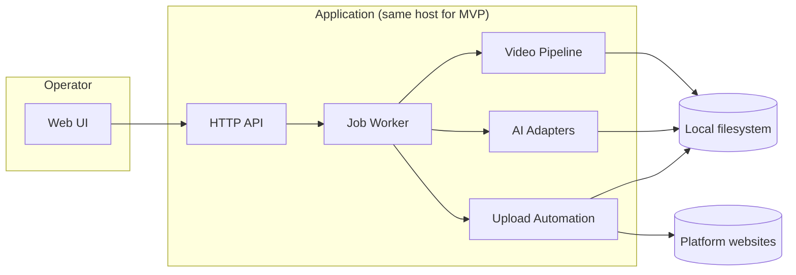

# Architecture v1 (MVP)

This document is the technical architecture draft for the MVP described in [`PRD.md`](./PRD.md). It defines boundaries, core data structures, API contracts at a draft level, and the job pipeline. Implementation details (exact libraries, selector maps for browser automation) are intentionally deferred to `[DEV]` spikes.

---

## 1. Goals and Constraints

| Goal | Implication |
|------|----------------|
| Local-first video ingest | Backend must run where disks are mounted; paths are authoritative. |
| Heavy CPU/GPU work (ASR, ffmpeg) | Prefer an async **job** model; web requests enqueue work and poll/stream status. |
| Per-platform export + metadata | Treat **platform** as a dimension on artifacts and metadata records. |
| **Douyin-first MVP** | Implement **Douyin** upload adapter + **9:16** export in MVP; `wechat_video` / `bilibili` exist as **config + stubs** until phase 2. |
| Browser-based upload (PRD) | Isolate **uploader** behind an interface; session state is sensitive and must not leak to logs. |
| **Persisted browser session** | After operator completes **one** successful platform login, store durable session artifacts (encrypted); reuse until expired. |
| No automatic retries (MVP) | Fail-fast jobs; rich step logs for post-mortem. |
| Manual publish confirmation | Separate states: `upload_prepared` vs `published`; user action transitions. |

---

## 2. High-Level System Context



**MVP deployment assumption** (customer-aligned): **local Windows** single machine for development and first production use; Linux headless remains an OPS follow-on. Web UI and worker may share one process initially (monolith) but **logical** boundaries below must remain separable for later split.

---

## 3. Logical Components

### 3.1 Web UI

- Configure **input root**, **output root**, and enabled platforms.
- List discovered **video assets**; search/filter by **tags**.
- Edit/confirm **tags** and AI-suggested tags.
- Trigger **pipeline job** for one selected video.
- Review per-platform **metadata** and **cover** preview.
- Drive **upload preparation** and final **Publish** confirmation per platform item.

### 3.2 HTTP API (control plane)

Responsibilities: validation, persistence of configuration and job records, artifact metadata indexing, log tail endpoints. It must not block on long-running ffmpeg/ASR.

### 3.3 Job Worker (execution plane)

Runs pipeline steps sequentially (MVP). Emits structured **step logs** and updates job state. On failure: stop immediately, persist error on the failing step.

### 3.4 Video Pipeline (`video_pipeline` domain)

- **Discovery**: recursive walk under input root; filter by extension/MIME sniff (implementation detail).
- **Official lyrics ingest**: operator-provided **官方歌词** (sidecar file, pasted text, or naming convention under `input_root`). Parsed to **`official_lyrics.json`** (immutable **import snapshot**). **ASR/LLM must not mutate** this import automatically.
- **Operator 微调 (UI)**: operator may edit line text/breaks in the web UI. Persist as **`lyrics_confirmed`** (defaults copy `official_lyrics` when no edits). **Alignment and burn-in use `lyrics_confirmed` only** (audit: keep both import and confirmed in artifacts per job).
- **VAD + transcript alignment** (ASR): produces time-aligned segments for **rhythm cuts** and assists **forced alignment**; ASR text is **not** shown as final captions when it conflicts with official lyrics.
- **Rhythm / speech-based cut**: selects segments to hit **30–60s** target duration (configurable bounds).
- **Forced alignment (post-cut)**:
  - After the **edited master** (30–60s) exists, align **`lyrics_confirmed`** lines to the **edited** vocal audio using **forced alignment** (e.g. Montreal Forced Aligner, WhisperX-style alignment, or DTW between vocal features and lyric tokens — `[DEV]` spike). Output: `aligned_subtitles` (ASS/SRT) with **only** characters from **confirmed** lines on screen.
  - If alignment confidence is low or live performance **diverges** from the sheet, surface a **reviewable timeline** in UI for nudge/skip (implementation detail); MVP fails fast only when lyrics are missing or unparseable.
- **Burn-in subtitles (全程跟唱词 + 官方词)**:
  - Subtitles span the **entire** final edited timeline; on-screen strings are **exactly** the aligned slices of **`lyrics_confirmed`** (plus display wrapping).
  - Presentation MVP: **default style** (font, outline, safe margin); **1–2 lines** with timed swap per aligned event.
- **Cover**: extract frame from **edited** timeline; overlay **cover caption** text.
- **Platform export**: ffmpeg graph per **platform profile** (resolution, SAR/DAR, fps, audio codec/bitrate).

### 3.5 AI Adapters (pluggable)

- **ASR**: Whisper-family or equivalent → `transcript` artifact with **word- or segment-level timestamps** for **cuts** and **alignment hints**. Final on-screen words come from **`lyrics_confirmed`**, not from ASR verbatim.
- **LLM**: structured JSON for **tags**, **title/description/hashtags**, **cover caption** only. **Forbidden**: generating or “fixing” lyric wording for burn-in. Optional: suggest **display line breaks** for official text **without** changing characters (same codepoints, only `\n` insertion).
- **Forced alignment**: may be a **non-LLM** component (signal processing / alignment library); treat as part of `video_pipeline` or `ai/align` per repo layout.
- Adapters read/write only via **artifact paths** + **redacted prompts** in logs (no secrets, no full raw media in prompts).

### 3.6 Upload Automation (browser)

- Uses a dedicated automation driver (e.g. Playwright) per platform implementation.
- Consumes: exported video file path, metadata fields, cover image path.
- Produces: `upload_prepared` state with platform-side reference if available (draft id / URL), or a clear failure.
- **Session handling**: encrypted local storage or OS secret store; never commit cookies to git. **MVP**: after **one** successful login, **persist** session until invalid (operator may re-login from UI when needed).

### 3.7 AI stack suggestions (balanced cost vs quality, Chinese, concert footage)

These are **recommendations**, not vendor locks. Concert audio (crowd noise, PA bleed) is hard; **官方词 + forced alignment** raises the bar on **vocal activity detection, ASR-assisted alignment, and optional vocal separation** — budget skews toward **alignment-quality tools** + **metadata LLM**, not toward “ASR as subtitles.”

| Role | If you want **lowest recurring cost** (local GPU/time) | If you want **low ops + predictable quality** (API $) |
|------|--------------------------------------------------------|--------------------------------------------------------|
| **ASR + timestamps** | **[faster-whisper](https://github.com/SYSTRAN/faster-whisper)** with **`large-v3`** (or **`medium`** if GPU VRAM tight); optionally **VAD filter** to reduce hallucinations on music-only stretches. | **OpenAI Audio API** (`whisper-1`) for short clips; or **Alibaba DashScope / FunASR** (strong Chinese, good for noisy speech). |
| **Tags + title/desc + hashtags + cover copy** (no lyric body) | Run a **small/medium LLM locally** (e.g. **Qwen2.5** family) via Ollama/vLLM — acceptable if you tune prompts. | **OpenAI** `gpt-4.1-mini` or `gpt-4o-mini` (cheap, reliable JSON); domestic: **通义千问 Qwen-Turbo/Plus** or **DeepSeek** (good CN cheap tier). |
| **Forced align (confirmed lyrics → time)** | Tooling spike: **WhisperX** alignment layer, MFA with known lyrics, or vendor **speech alignment** APIs that accept **fixed text**. | Same, or human-in-the-loop correction in UI when tools fail on live mixes. |

**Practical default pairing (good balance)**:
- **API path**: `gpt-4o-mini` or `gpt-4.1-mini` (metadata JSON) + **ASR** for cuts/alignment hints + **forced-align spike** (tool TBD) for **official** lyric timestamps.
- **Local path**: **faster-whisper `large-v3`** (cuts + phoneme/time hints) + **Qwen2.5** (7B–14B) for metadata only — tune prompts for **演唱会**; align **operator-confirmed** lines in a separate alignment step.

**Prompt note**: pass **transcript excerpts + tag hints**, not raw video bytes, to LLM; keep **human review** in UI (PRD).

---

## 4. Core Data Model (draft)

All IDs are UUID strings unless noted.

### 4.1 `WorkspaceConfig`

| Field | Type | Notes |
|-------|------|--------|
| `input_root` | string (path) | User-configured scan root. |
| `output_root` | string (path) | Artifact root for jobs. |
| `enabled_platforms` | `Platform[]` | MVP default: `[ "douyin" ]`. Schema may include `wechat_video`, `bilibili` (stubs / no acceptance until phase 2). |
| `default_orientation` | enum | MVP default: `portrait` (**9:16**) for Douyin. |
| `subtitle_style_id` | string | MVP: single built-in style. |
| `target_duration_sec` | `{ min: 30, max: 60 }` | MVP default from PRD. |

### 4.2 `VideoAsset`

| Field | Type | Notes |
|-------|------|--------|
| `id` | uuid | |
| `absolute_path` | string | Canonical path on disk. |
| `relative_path` | string | Relative to `input_root` for display/search. |
| `discovered_at` | datetime | |
| `tags_confirmed` | `string[]` | Theme/content type labels. |
| `tags_suggested` | `string[]` | AI proposals pending confirmation. |
| `lyrics_source_type` | enum? | `sidecar_file` \| `pasted` \| `convention` (e.g. `*.lyrics.txt` next to video). |
| `lyrics_sidecar_relative_path` | string? | Relative to `input_root` when using sidecar. |
| `lyrics_text` | string? | When pasted in DB only (avoid huge blobs in MVP if file preferred). |
| `lyrics_confirmed_lines` | `string[]`? | Latest UI-edited lines; if null at job start, worker copies `official_lyrics` parse into job artifact as confirmed. |

### 4.3 `PipelineJob`

| Field | Type | Notes |
|-------|------|--------|
| `id` | uuid | |
| `video_asset_id` | uuid | |
| `status` | enum | See §6. |
| `current_step` | string | Machine-readable step name. |
| `error` | object? | `{ step, message, log_pointer }` |
| `created_at` / `updated_at` | datetime | |

### 4.4 `Artifact` (logical)

Stored under `output_root/jobs/{job_id}/...` with a manifest JSON.

| Kind | Example relative path | Description |
|------|------------------------|-------------|
| `official_lyrics` | `artifacts/official_lyrics.json` | Lines/tokens from **import** (immutable snapshot for audit). |
| `lyrics_confirmed` | `artifacts/lyrics_confirmed.json` | Lines after operator **微调**; feeds `lyrics_force_align`. |
| `transcript` | `artifacts/transcript.json` | ASR segments + timestamps (cuts + alignment **support**, not caption source). |
| `aligned_subtitles` | `artifacts/subtitles.ass` or `.srt` | **Official** text + timestamps on **edited** timeline. |
| `tags` | `artifacts/tags.json` | Suggested + confirmed snapshot. |
| `edit_timeline` | `artifacts/timeline.json` | Selected cuts, target duration rationale. |
| `master_edit` | `video/master.mp4` | Pre-platform master (optional if per-platform diverges early). |
| `cover` | `images/cover.png` | Frame + caption overlay. |
| `export` | `exports/{platform}/final.mp4` | Platform-matched encode. |
| `metadata` | `metadata/{platform}.json` | Title, description, hashtags, cover caption (no lyric replacement). |
| `job_log` | `logs/job.log` | Append-only or structured JSON lines. |

### 4.5 `PlatformPublishItem`

One row per (`job_id`, `platform`).

| Field | Type | Notes |
|-------|------|--------|
| `platform` | enum | `douyin` \| `wechat_video` \| `bilibili` |
| `state` | enum | `pending` → `upload_prepared` → `published` \| `failed` |
| `draft_url` | string? | If automation exposes a draft link. |
| `platform_ref` | string? | Opaque id from platform when available. |
| `last_error` | string? | |

---

## 5. REST API Contract (draft, MVP)

Base path: `/api/v1`. Responses JSON. Errors: `{ "error": { "code", "message", "details?" } }`.

| Method | Path | Purpose |
|--------|------|---------|
| `GET` | `/config` | Read `WorkspaceConfig`. |
| `PUT` | `/config` | Update roots/platforms (validate paths exist). |
| `POST` | `/library/scan` | Scan `input_root`; upsert `VideoAsset` records. |
| `GET` | `/library/videos` | Query list; filters: `tag`, `q` (path substring). |
| `GET` | `/library/videos/{id}` | Detail + latest job summary. |
| `PATCH` | `/library/videos/{id}/tags` | Set `tags_confirmed`; optional merge with suggestions. |
| `PUT` | `/library/videos/{id}/lyrics` | Body: raw text **or** relative sidecar path under `input_root`; validates parse; resets **confirmed** to match import unless `preserve_confirmed=true`. |
| `PATCH` | `/library/videos/{id}/lyrics/confirmed` | Body: `{ "lines": string[] }` operator **微调**; validates non-empty. |
| `GET` | `/library/videos/{id}/lyrics` | Returns **import** preview, **confirmed** lines, and source metadata. |
| `POST` | `/library/videos/{id}/tags/suggest` | Run AI tag suggestion; returns proposals (does not auto-commit). |
| `POST` | `/jobs` | Body: `{ "video_asset_id" }` → enqueue `PipelineJob`. |
| `GET` | `/jobs/{id}` | Job status + artifact manifest pointers. |
| `GET` | `/jobs/{id}/logs` | Step logs (paginated / tail). |
| `POST` | `/jobs/{id}/publish/{platform}/prepare` | Run upload automation to draft/prepared state. |
| `POST` | `/jobs/{id}/publish/{platform}/confirm` | Final publish after operator review (PRD). |

**WebSocket (optional MVP+1)**: `WS /jobs/{id}/stream` for log tail; MVP can poll `GET /jobs/{id}`.

---

## 5.1 Lyrics Ingest + Confirm (MVP schema details)

This section fixes the request/response shapes and artifact JSON formats for:
- `lyrics_ingest_validate` (import snapshot)
- operator `微调` (confirmed snapshot)
- `lyrics_force_align` (timed subtitles based on the confirmed snapshot)

### 5.1.1 `PUT /library/videos/{id}/lyrics` (import official lyrics)

Request body (JSON):

```json
{
  "mode": "pasted" | "sidecar_file" | "convention",
  "text": "string (required when mode=pasted)",
  "sidecar_relative_path": "string (required when mode=sidecar_file)",
  "preserve_confirmed": true | false
}
```

Notes:
- `mode=convention`: server derives a lyrics file path under `input_root` by an agreed naming rule (exact rule TBD; MVP can start with a simple convention).
- `preserve_confirmed=false` means: overwrite `lyrics_confirmed` with the imported lines (operator confirmation resets to match import).

Response body (JSON):

```json
{
  "video_asset_id": "uuid",
  "import": { "lines": ["line1", "line2"] },
  "confirmed": { "lines": ["line1", "line2"], "changed": false },
  "source": {
    "mode": "pasted | sidecar_file | convention",
    "sidecar_relative_path": "string?",
    "imported_at": "RFC3339 timestamp"
  }
}
```

Fail conditions (MVP):
- required inputs missing for the selected `mode`
- parsed `lines` is empty after normalization

### 5.1.2 `PATCH /library/videos/{id}/lyrics/confirmed` (operator micro-tuning)

Request body:

```json
{
  "lines": ["line1", "line2"]
}
```

Response body:

```json
{
  "video_asset_id": "uuid",
  "confirmed": { "lines": ["line1", "line2"], "changed": true }
}
```

Rules:
- LLM/ASR must not change lyric wording; this endpoint is the only permitted place for user-edited lyric text.

### 5.1.3 `GET /library/videos/{id}/lyrics`

Response body:

```json
{
  "video_asset_id": "uuid",
  "source": {
    "mode": "pasted | sidecar_file | convention",
    "sidecar_relative_path": "string?",
    "imported_at": "RFC3339 timestamp"
  },
  "import": { "lines": ["line1", "line2"] },
  "confirmed": { "lines": ["line1", "line2"], "changed": true }
}
```

### 5.1.4 Artifact JSON formats (files under `output_root/jobs/{job_id}/...`)

`official_lyrics.json`:

```json
{
  "version": 1,
  "source": { "mode": "pasted|sidecar_file|convention", "sidecar_relative_path": "string?", "imported_at": "RFC3339" },
  "lines": ["line1", "line2"]
}
```

`lyrics_confirmed.json`:

```json
{
  "version": 1,
  "basis": { "imported_snapshot_id": "string?" },
  "confirmed_at": "RFC3339 timestamp",
  "lines": ["line1", "line2"]
}
```

`aligned_subtitles`:
- emitted as `ass` or `srt`
- every on-screen string must be copied from `lyrics_confirmed.lines` (no LLM rewrite)

## 6. Job State Machine (pipeline steps)

States for `PipelineJob.status`:

1. `queued`
2. `running`
3. `succeeded`
4. `failed`

`current_step` values (ordered):

| Step key | Produces |
|----------|-----------|
| `discover_validate` | Verify input file readable. |
| `lyrics_ingest_validate` | `official_lyrics.json` from operator source; **fail** if missing/empty. Snapshot **`lyrics_confirmed.json`** (copy import if no prior UI edits). |
| `asr_transcribe` | `transcript.json` (cuts + alignment hints) |
| `tag_suggest` (optional if not pre-run) | updates `tags_suggested` snapshot in artifact |
| `auto_edit_cut` | `timeline.json`, intermediate rendered clip (30–60s) |
| `lyrics_force_align` | `subtitles.ass` / `.srt` mapping **`lyrics_confirmed`** lines to **edited** audio |
| `subtitle_burnin` | video with burned-in subtitles |
| `cover_generate` | `cover.png` |
| `metadata_llm` | `metadata/{platform}.json` for each enabled platform |
| `platform_export` | `exports/{platform}/final.mp4` |
| `upload_prepare` | per-platform, operator-triggered or auto-chained after export (product choice: default **auto after export** with UI showing progress; `publish/confirm` remains manual) |

On failure: `status=failed`, `error.step` = failing key, stop pipeline.

---

## 7. Platform Profiles (encoding matrix)

Store as data-driven config, e.g. `config/platform_profiles.json`.

| Platform | Phase | Target aspect | Resolution (MVP default) | Notes |
|----------|-------|----------------|----------------------------|--------|
| Douyin | **MVP** | **9:16** | **1080×1920** | Customer default portrait; validate file size/bitrate vs Douyin limits before upload. |
| WeChat Video | Phase 2 | TBD | TBD | Retain enum + profile slot; adapter not in MVP acceptance. |
| Bilibili | Phase 2 | TBD | TBD | Retain enum + profile slot; adapter not in MVP acceptance. |

---

## 8. Logging Design

- **Structured log event** per step: `timestamp`, `job_id`, `step`, `level`, `message`, `data` (sanitized).
- **Tooling summary** for ffmpeg: command argv **without** secrets; file paths truncated if needed.
- **AI logs**: store model id, token usage (if available), schema version, and **hashed** prompt fingerprint — not raw prompts with PII by default.
- **Failure bundle**: path to `logs/job.log` and optional `logs/step_{name}.txt` in artifact folder.

---

## 9. Security and Secrets

| Asset | Handling |
|-------|----------|
| Platform session cookies / tokens | OS/user-scoped secret store or encrypted SQLite; configurable path outside repo. |
| LLM API keys | Environment variables; never checked into git (see `.gitignore`). |
| Paths | Validate under allowed roots to prevent path traversal from web API. |

---

## 10. OpenClaw Compatibility (design intent)

Keep these boundaries **interface-first** so automation agents can orchestrate the same flows without UI:

- `IVideoPipeline` — run steps given `job_id` + paths.
- `IUploadAdapter` — `prepare_draft()` / `publish_confirmed()`.
- `IAiTagger`, `IAiMetadata` — structured JSON in/out (metadata only; no lyric invention).
- `ILyricsAligner` — **`confirmed_lines`** + `edited_audio_path` + optional ASR hints → timed ASS/SRT.

---

## 11. Suggested Repository Layout (post-implementation)

```
src/
  api/                 # HTTP handlers (future)
  worker/              # job runner
  pipeline/            # ffmpeg, cutting, subtitles, export
  ai/                  # ASR + LLM adapters
  upload/              # per-platform Playwright adapters
  models/              # pydantic/dataclasses for §4
  storage/             # artifact manifest IO
tests/
```

MVP may start thinner (e.g. `video_pipeline.py` growing into `pipeline/`) but **must not** merge upload automation into ffmpeg modules.

---

## 12. Affected Files (before `[DEV]` implementation)

When implementation starts, expect to touch or add:

| Area | Files / dirs |
|------|----------------|
| Docs | `docs/ARCHITECTURE.md` (this file), `docs/PRD.md` (if scope changes) |
| Task tracking | `Task_Control.md` |
| Container | `docker-compose.yml` (API + worker services later) |
| Pipeline entry | `src/video_pipeline.py` (split per §11) |
| New | `src/models/`, `src/pipeline/`, `src/upload/`, `src/ai/`, `tests/` |
| Config | `config/platform_profiles.json` (new), `.env.example` (new, no secrets) |

---

## 13. Risks (architecture-level)

- **Browser automation fragility**: selectors break; mitigate with adapter versioning + recorded traces in logs (screenshots optional, privacy-sensitive).
- **Git SSH vs PuTTY**: Windows dev machines may need `core.sshCommand` for OpenSSH when using Git — unrelated to product runtime but affects `[OPS]` docs.
- **Platform policy changes**: export specs and upload flows must be data-driven and isolated per adapter.

---

## 14. MVP Implementation Sequence (for roadmap)

1. Filesystem scan + persistence + tag API (`input_root` / `output_root` from workspace config).
2. Job skeleton + artifact layout + structured logging.
3. Lyrics ingest API + **lyrics_ingest_validate** step.
4. ASR → transcript artifact (noisy concert; supports alignment).
5. Cut + duration target + **lyrics_force_align** + burn-in subtitles + cover.
6. **Douyin** export profile (**9:16**, 1080×1920) + placeholder profiles for future platforms.
7. LLM metadata for **Douyin** + UI review contract (reuse API models).
8. **Douyin** upload adapter: draft preparation + manual confirm publish; stub interfaces for other platforms.

---

*End of Architecture v1 (MVP draft).*
